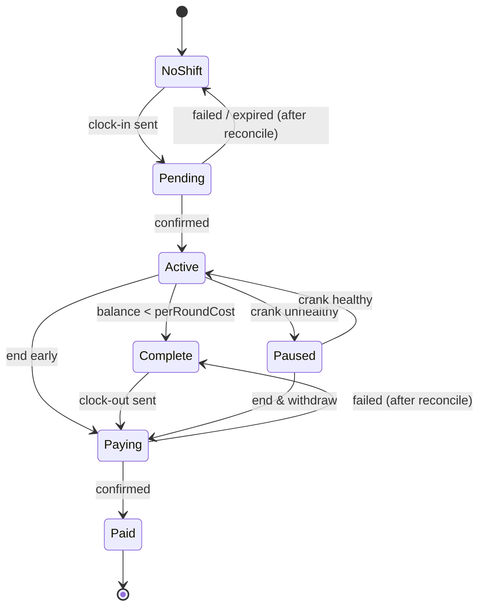

# SHIFT — Product Requirements Document

**Clock in once. ORE works your shift. Get paid at clock-out.**

| Field | Value |
|---|---|
| Status | v1.0, build-ready. Items marked **[VERIFY]** must be confirmed in source before the dependent code is written |
| Owner | Solo builder (product, engineering, demo) |
| Builder | Human + Claude Code (see `shift-claude-code-prompt.md`) |
| Target | CLOCK IN hackathon (Solana Mobile × Radiants): Mobile track + ORE matched prize |
| Hard deadline | **9 Oct 2026, 06:59 UTC.** Internal freeze 8 Oct 18:00 UTC; submit by 8 Oct 23:00 UTC |
| Companion docs | `shift-project-brief.md` (research and rationale) |

### Change log
| Date | Version | Change |
|---|---|---|
| 4 Oct 2026 | 1.0 | First build-ready version |

---

## 0. One-page summary

**Problem.** Seeker owners have a crypto phone and no low-effort daily reason to use it. ORE mining is the clearest example. Over 25% of ORE mining already happens on Seeker, but its loop is a one-minute, 5×5-grid round that expects you to watch, choose squares and sign every round. On a phone, Mobile Wallet Adapter (MWA) sessions drop when the app is backgrounded, and app state is lost when it crashes. Nobody keeps doing this daily.

**Bet (falsifiable).** If a Seeker owner can take part in ORE mining with **one signature to start and one to finish**, a **loss cap shown before signing**, and a **payslip that is correct even after the app is killed**, they'll come back on most days. We'll know it's working when testers complete at least 4 shifts in their first 7 days and at least 80% of started shifts end with a clock-out (claim).

**Solution.** A mobile app that wraps ORE's native `Automate` instruction in workplace metaphors:
- **Clock in:** fund a capped automation.
- **Shift:** an executor deploys each round while you're away.
- **Payslip:** results rebuilt from on-chain accounts.
- **Clock out:** claim winnings.
- **Timesheet:** streak history written as on-chain memos.

**Scope.** Android only, a single protocol (ORE), solo build, 4.5 days. **Non-goals:** a manual grid UI, other protocols, iOS/web, social features, SKR.

---

## 1. How this PRD was written (research applied)

Common traits of strong PRDs, from Lenny Rachitsky's 1-pager guidance, Kevin Yien's Square template, Figma/Product Hunt templates, and practitioner critiques, and how this document applies each one:

| What separates a buildable PRD from a vague one | How it's applied here |
|---|---|
| **Problem first, in a few strong sentences near the top** (Lenny) | §0 and §2 lead with the problem and evidence, before any features |
| **Explicit non-goals**: a PRD that never says "no" says "yes" to everything (Square/Yien) | §12, plus non-goals in §0 |
| **Testable numbers, not adjectives** ("< 2 s", not "fast") | Every NFR in §8 has a number and a way to measure it |
| **Acceptance criteria per feature, in a checkable format** | Each feature has ID'd criteria written as WHEN/THE APP SHALL (EARS style, as used by spec-driven agent tools) so Claude Code can test against them |
| **Edge cases written down before code, not found in code review** | §10 lists 25+ cases with required behaviour |
| **A falsifiable bet and counter-metrics, not just goals** | §3 includes kill thresholds and a counter-metric on user losses |
| **Open questions with owners and deadlines** | §14. Blockers are flagged and gate specific milestones |
| **Template tailored to the project, not filled in blindly** | No personas boilerplate. PRD and tech spec are **combined** because there's one builder and one AI agent; separating "what" from "how" only helps when they're different people |

---

## 2. Problem statement

### Who is hurting
Seeker owners. Solana Mobile reports 200K+ devices shipped and 800+ dApp Store apps. Within that group, the ORE miners (25%+ of all ORE mining) and the much larger group of owners who've heard of ORE but bounced off it.

### What they do today, and why it fails
| Today | Failure |
|---|---|
| Mine manually in ORE's app or ore.supply | Requires attention every round; the grid strategy is confusing on a 6.3" screen; variance is unclear |
| Use automining through ORE or third parties | Works, but the UX is raw: no daily ritual, unclear results, no habit layer |
| Use other Seeker apps | Reviews describe crashes on reopen, broken wallet connections, lost Seed Vault state, and engagement that ends once the airdrop does |

### Why now
- The hackathon rewards stickiness (25% of the score).
- ORE offers a matched prize for an integration where ORE is the core product.
- ORE's program already provides `Automate`, so no smart contract needs to be written.

---

## 3. Goals, success metrics, and counter-metrics

### Hackathon goals (by 9 Oct)
| ID | Goal | Measure |
|---|---|---|
| G1 | Working end-to-end loop on a physical Android device, on mainnet | Demo video shows clock-in → app force-killed → reopen → correct payslip → clock-out |
| G2 | Meet every submission requirement | APK, public repo, ~3-min video, deck all submitted before the internal deadline |
| G3 | Qualify for the ORE matched prize | ORE integration is live, user-facing and the core of the product |

### Product metrics (first 2 weeks after launch; instrumented from on-chain data, no analytics SDK)
| Metric | Definition | Target | Kill / rethink threshold |
|---|---|---|---|
| **Activation** | % of wallets that connect and complete one clock-in | ≥ 60% | < 30% |
| **Probation completion** | % of activated users with ≥ 4 shifts in their first 7 days | ≥ 35% | < 15% |
| **Clock-out rate** | % of started shifts that end with a SHIFT clock-out transaction | ≥ 80% | < 50% (payslip isn't pulling people back) |
| **Signatures per day** | Median MWA signatures per active user per day | ≤ 2 | > 4 |
| **Crash-free sessions** | Sessions without a JS fatal error or ANR | ≥ 99% | < 97% |
| **Executor liveness** | % of rounds in which an eligible SHIFT automation was deployed | ≥ 98% | < 90% |

### Counter-metrics (must not get worse)
- **Loss containment:** no shift may ever spend more than its stated budget (hard invariant: 0 violations).
- **Budget creep:** median budget per shift should not rise week on week by more than 25% without a user setting change. This is our check on encouraging chasing losses.

---

## 4. Target users and user stories

### Users
| User | Description | Primary need |
|---|---|---|
| **U1 — The commuter miner** | Owns a Seeker, holds some SOL, has mined ORE before, has a busy day | Mine without babysitting; see results later |
| **U2 — The ORE-curious owner** | Owns a Seeker, never mined, put off by the grid and risk | A bounded, understandable first try |
| **U3 — Hackathon judge** | Evaluates the demo, repo and APK | See the core loop work, read clean code, verify the security posture |

### User stories
| ID | Story | Feature |
|---|---|---|
| US-1 | As U1, I want to connect my Seed Vault wallet once and not be asked again every time I open the app | F1 |
| US-2 | As U2, I want to pick a simple role and see my maximum possible loss before I sign anything | F2 |
| US-3 | As U1, I want to start a mining shift with one signature and then close the app | F3, F4 |
| US-4 | As U1, I want to glance at my active shift and see how far along it is | F5 |
| US-5 | As U1, I want the app to show correct results even if it crashed or I reinstalled it | F6 |
| US-6 | As U1, I want a clear payslip of what I spent, won and earned when the shift ends | F6 |
| US-7 | As U1, I want to collect my winnings with one signature | F7 |
| US-8 | As U1, I want a notification when my shift ends | F8 |
| US-9 | As U2, I want a streak and a forgiving day off, so missing one day doesn't wipe my progress | F9 |
| US-10 | As U1, I want to share my payslip | F10 |
| US-11 | As U3, I want to see that the app never holds my keys and can't overspend | F3, F4, NFR-S |

---

## 5. Features, prioritised

**P0** = without it there's no demo. **P1** = expected for a competitive submission. **P2** = only if ahead of schedule.

| ID | Feature | Priority | Stories |
|---|---|---|---|
| F1 | Wallet connect (MWA 2.0, Seed Vault, cached auth token) | P0 | US-1 |
| F2 | Shift setup: role, budget and length, with loss cap shown | P0 | US-2 |
| F3 | Clock in: `Automate` + SHIFT memo in one signed transaction | P0 | US-3, US-11 |
| F4 | Executor crank: deploys rounds for SHIFT automations | P0 | US-3, US-11 |
| F5 | Active shift screen | P0 | US-4 |
| F6 | Reconciler + payslip, rebuilt from chain | P0 | US-5, US-6 |
| F7 | Clock out: claim SOL/ORE + memo; withdraw leftover balance | P0 | US-7 |
| F8 | Shift-end local notification | P1 | US-8 |
| F9 | Timesheet, streak, PTO day, probation week | P1 | US-9 |
| F10 | Shareable payslip card | P1 | US-10 |
| F11 | Crank status indicator in the app | P1 | US-11 |
| F12 | Home-screen widget | P2 | — |
| F13 | Motherlode push notification from the crank | P2 | — |

---

## 6. Functional requirements, flows, and acceptance criteria

Criteria use the form **WHEN [condition] THE APP SHALL [behaviour]**. Each criterion ID is referenced by the tests and the Claude Code build plan.

### F1 — Wallet connect
**Flow:** first launch → welcome screen ("Clock in once…") → **Connect** → MWA `authorize` (chain `solana:mainnet`, app identity: name SHIFT, URI, icon) → wallet approves → home.

Functional requirements:
- FR-1.1: Use MWA 2.0 via the official JS packages from the Solana Mobile template.
- FR-1.2: Store `auth_token` and the public key in secure storage (`expo-secure-store`).
- FR-1.3: On later launches, pass the cached `auth_token` to `authorize` for silent reauthorisation.
- FR-1.4: Provide **Disconnect**, which calls `deauthorize` and clears the cache.

Acceptance criteria:
- **AC-1.1** WHEN the user taps Connect and approves THE APP SHALL show the home screen with the abbreviated wallet address within 2 s of approval.
- **AC-1.2** WHEN the app is relaunched with a valid cached token THE APP SHALL NOT show an approval prompt for read-only screens.
- **AC-1.3** WHEN no MWA-compatible wallet is installed THE APP SHALL show "No compatible wallet found" with a link to install one, and SHALL NOT crash.
- **AC-1.4** WHEN the user rejects authorisation THE APP SHALL return to the welcome screen with a non-blocking message.
- **AC-1.5** WHEN the cached token is rejected THE APP SHALL clear it and fall back to a normal `authorize` prompt on the next signing action.

### F2 — Shift setup
**Flow:** home → **Start a shift** → choose role → choose budget → choose length → review card → **Clock in** (F3).

Roles (constants in `config/roles.ts`, tunable):
| Role | Squares covered | Copy shown to user |
|---|---|---|
| Safe | 20 | "Wins most rounds, small payouts" |
| Balanced | 10 | "Even mix" |
| Sniper | 3 | "Rarely wins, bigger payouts" |

Budget presets: 0.02 / 0.05 / 0.10 SOL. Hard maximum 0.5 SOL in MVP. Length presets: 1 h / 4 h / 8 h.

Calculation (pure function `planShift`):
- `targetRounds = lengthMinutes × 60 ÷ ROUND_SECONDS` [VERIFY the round duration]
- `perRoundLamports = floor(budgetLamports ÷ targetRounds)`
- `perSquareLamports = floor(perRoundLamports ÷ squares)`
- `executorFeePerRound` comes from config [VERIFY fee semantics]
- If `perSquareLamports < ORE_MIN_DEPLOY` [VERIFY]: reduce `targetRounds` until it's valid and show the adjusted length.
- `estimatedEnd = now + actualRounds × ROUND_SECONDS`

Functional requirements:
- FR-2.1: The review card shows the role, budget, **"Max you can lose: {budget} SOL"**, estimated rounds, estimated end time, executor fee total, and the network fee + rent reserve.
- FR-2.2: Before showing the review card, check the wallet balance is at least budget + rent + 0.01 SOL fee reserve.

Acceptance criteria:
- **AC-2.1** WHEN any role/budget/length combination is selected THE APP SHALL display a max-loss figure equal to the budget, to 4 decimal places.
- **AC-2.2** WHEN the computed per-square amount is below the protocol minimum THE APP SHALL reduce the rounds and show "Shortened to {n} rounds to meet ORE's minimum".
- **AC-2.3** WHEN the wallet balance is insufficient THE APP SHALL disable Clock in and show the amount needed.
- **AC-2.4** `planShift` SHALL have unit tests covering every preset combination and the minimum-deploy boundary.

### F3 — Clock in
**Flow:** review card → **Clock in** → simulate the transaction → MWA `signAndSendTransactions` → confirming state → active shift (F5).

Transaction contents (one transaction, signed by the user):
1. **ORE `Automate`** with: amount = `perSquareLamports`, deposit = `budgetLamports`, fee = configured executor fee, mask = role mask, strategy = Preferred, reload = 0 (off), executor = crank public key. Exact account list and data layout: [VERIFY] from `ore-api` (§9.4).
2. **Memo v2** (`MemoSq4gqABAXKb96qnH8TysNcWxMyWCqXgDLGmfcHr`) with the IN record (§9.3).
3. Compute-budget instructions, if simulation shows they're needed.

Functional requirements:
- FR-3.1: Before clock-in, read the user's Automation PDA. If an automation exists that is not a SHIFT automation (wrong executor, or no SHIFT IN memo), **block** and show the conflict screen (edge case E-6).
- FR-3.2: Simulate the transaction before requesting a signature; on failure, show a decoded error and do not prompt.
- FR-3.3: After sending, poll the signature status until finalized/confirmed, or until 60 s pass and the blockhash expires.

Acceptance criteria:
- **AC-3.1** WHEN the user taps Clock in and approves THE APP SHALL submit exactly one transaction containing `Automate` and the SHIFT IN memo.
- **AC-3.2** WHEN the transaction confirms THE APP SHALL show the active shift screen, and the on-chain Automation account SHALL have balance = budget, executor = crank key, and reload off.
- **AC-3.3** WHEN simulation fails THE APP SHALL NOT open the wallet and SHALL show a readable error.
- **AC-3.4** WHEN the MWA session errors after sending, or the confirmation is unknown, THE APP SHALL reconcile from chain (F6) before offering a retry, and SHALL NEVER submit a second clock-in for a shift that already exists.
- **AC-3.5** WHEN a non-SHIFT automation exists THE APP SHALL NOT create or modify it.

### F4 — Executor crank (server)
A Node/TypeScript service that holds only the executor keypair and the SOL it needs for transaction fees.

Loop, run every round:
1. Fetch the current round/board state [VERIFY account].
2. Fetch all Automation accounts where executor = crank key, using `getProgramAccounts` with a memcmp filter on the executor offset [VERIFY the offset].
3. Select those with `balance ≥ perRoundCost` where the current round hasn't been deployed yet.
4. Build the executor-side deploy instructions [VERIFY: which instruction an executor calls for an automation, and its accounts]. Batch as many as fit per transaction.
5. Send with a priority fee and retry up to the round deadline.
6. Log the outcome.

Functional requirements:
- FR-4.1: `GET /health` returns `{ ok, crankPubkey, lastRoundId, lastRoundDeployedAt, activeAutomations, slotLag, solBalance }`.
- FR-4.2: A `DRY_RUN=1` mode builds and simulates transactions without sending them.
- FR-4.3: The crank never signs anything other than executor deploy transactions. No withdraw, claim or transfer code exists in the crank.
- FR-4.4: Configuration comes from env vars only: `RPC_URL`, `EXECUTOR_KEYPAIR` (base58 or JSON), `PRIORITY_FEE_MICROLAMPORTS`, `PORT`.

Acceptance criteria:
- **AC-4.1** WHEN a SHIFT automation has balance ≥ the per-round cost THE CRANK SHALL deploy it in ≥ 98% of rounds over a 30-minute test.
- **AC-4.2** WHEN an automation's balance falls below the per-round cost THE CRANK SHALL stop deploying it and SHALL NOT error.
- **AC-4.3** WHEN the crank restarts THE CRANK SHALL resume within one round with no local state needed.
- **AC-4.4** `DRY_RUN=1` SHALL produce successful simulations against mainnet for a live test automation.
- **AC-4.5** The crank's source SHALL contain no instruction builders other than the executor deploy path (checked by code review).

### F5 — Active shift screen
Shows:
- Role, budget, a progress ring (rounds worked ÷ planned rounds)
- Estimated time left
- Running SOL won and ORE earned (marked "≈ live")
- Crank status dot (F11)
- **End shift early** (runs F7)

Refresh: on focus, on pull-to-refresh, and every 30 s while in the foreground. No background polling.

Acceptance criteria:
- **AC-5.1** WHEN the screen gains focus THE APP SHALL reconcile and render within 2 s (p50) on a Seeker over Wi-Fi.
- **AC-5.2** WHEN reconciliation fails THE APP SHALL show the last cached values with a "Last updated {time}" banner.
- **AC-5.3** WHEN the automation balance is below the per-round cost THE APP SHALL switch to the **Shift complete — see payslip** state.

### F6 — Reconciler + payslip
A pure function `reconcile(chainSnapshot, memos) → AppState` (§9.2) plus a fetch layer. The device cache is never the source of truth.

Fetch, using at most 3 RPC calls per refresh:
1. `getMultipleAccounts([automationPda, minerPda, boardPda])` [VERIFY PDAs]
2. `getSignaturesForAddress(wallet, { until: lastSeenSig, limit: 100 })`, filtered to memos starting with `SHIFT1|`

Payslip fields (for each shift, using the baseline recorded in the IN memo):
| Field | Formula |
|---|---|
| Rounds worked | `floor((budget − balanceRemaining) ÷ (perSquare × squares + feePerRound))` |
| SOL deployed | `rounds × perSquare × squares` |
| Executor fees | `rounds × feePerRound` [VERIFY fee semantics] |
| SOL won | `miner.rewardsSol − baseline.minerSol` [VERIFY field] |
| ORE earned | `miner.rewardsOre − baseline.minerOre` [VERIFY: unrefined vs refined] |
| Net SOL | `SOL won + balanceRemaining − budget` |

Losses are shown first and in plain language: "You put in 0.05 SOL. You got back 0.031 SOL + 0.012 ORE."

Acceptance criteria:
- **AC-6.1** WHEN the app is force-killed mid-shift and reopened THE APP SHALL show payslip values that match the values computed from a block explorer read of the same accounts.
- **AC-6.2** WHEN app data is cleared or the app is reinstalled THE APP SHALL rebuild all shifts from the last 60 days of memos after reconnecting.
- **AC-6.3** WHEN a delta is negative (rewards claimed elsewhere) THE APP SHALL show "Some rewards were claimed outside SHIFT" and SHALL NOT show negative winnings.
- **AC-6.4** `reconcile` SHALL be a pure function with fixture-based unit tests covering all shift states in §9.2.

### F7 — Clock out
**Flow:** payslip → **Clock out & collect** → simulate → MWA sign → confirmed → payslip stamped **PAID**.

Transaction contents: ORE `ClaimSOL` + `ClaimORE` [VERIFY: whether to claim refined, unrefined or both, and the bps parameter in newer versions] + a call that stops the automation and returns its remaining balance [VERIFY: `Automate` with zero values, or `Close`] + SHIFT OUT memo.

Acceptance criteria:
- **AC-7.1** WHEN the user clocks out THE APP SHALL submit one transaction that claims rewards, returns any remaining automation balance, and writes the OUT memo.
- **AC-7.2** WHEN the transaction confirms THE APP SHALL show the payslip as PAID, and the Automation balance SHALL be 0 (or the account closed).
- **AC-7.3** WHEN the user taps End shift early during an active shift THE APP SHALL show a confirmation stating the returned balance, then run the same flow.
- **AC-7.4** WHEN there are no rewards to claim THE APP SHALL omit the claim instructions rather than send ones that fail.

### F8 — Shift-end notification (P1)
- FR-8.1: Schedule a local notification at `estimatedEnd` when clock-in confirms; cancel it if the shift is ended early.
- FR-8.2: Request notification permission at the first clock-in, not at launch.
- **AC-8.1** WHEN the estimated end time passes THE DEVICE SHALL show "Shift over — your payslip is ready", and tapping it SHALL open the payslip.
- **AC-8.2** WHEN permission is denied THE APP SHALL keep working with no repeated prompts.

### F9 — Timesheet, streak, PTO, probation (P1)
- FR-9.1: The timesheet is a month calendar; a day is marked if any IN memo has that `localDate`.
- FR-9.2: **Streak** = consecutive days ending today or yesterday, where a missed day is covered by **PTO**: one free missed day per ISO week, applied automatically and deterministically, oldest first.
- FR-9.3: **Probation week:** for the first 7 days after the user's first shift, show "Probation: {n}/5 shifts". Completing it shows a **Hired** badge (client-side only).
- FR-9.4: Reject a `localDate` that differs from the transaction's `blockTime` by more than 36 h; treat it as the `blockTime` date instead.
- **AC-9.1** Streak calculation SHALL be a pure function with tests: no shifts, a single day, consecutive days, one gap covered by PTO, two gaps in one week (breaks), a timezone-boundary case.
- **AC-9.2** WHEN rebuilt from chain on a fresh install THE APP SHALL show the same streak as before the reinstall.

### F10 — Shareable payslip card (P1)
- **AC-10.1** WHEN the user taps Share THE APP SHALL render a payslip image (role, rounds, net SOL, ORE, streak, no wallet address unless the user toggles it on) and open the Android share sheet.

### F11 — Crank status (P1)
- **AC-11.1** WHEN `/health` is unreachable, or `lastRoundDeployedAt` is more than 3 rounds old, THE APP SHALL show an amber "Shift paused — executor offline. Your funds are safe in the ORE program", with **End shift & withdraw** offered.

---

## 7. Screens (minimum set)
1. **Welcome / connect**
2. **Home**: today's state (no shift / active / complete), streak chip, Start a shift
3. **Shift setup**: role → budget → length → review card
4. **Active shift**
5. **Payslip**: unpaid / PAID
6. **Timesheet**
7. **Conflict / error screens**: existing automation, no wallet, insufficient SOL
8. **Settings**: wallet, disconnect, RPC status, crank status, "How SHIFT works & risks"

---

## 8. Non-functional requirements

### Performance
| ID | Requirement | How measured |
|---|---|---|
| NFR-P1 | Cold start to an interactive home screen with cached state in ≤ 3 s on a Seeker | Stopwatch on device, median of 5 |
| NFR-P2 | Reconcile and render ≤ 2 s p50 and ≤ 5 s p95 over Wi-Fi | Timing logs in dev build |
| NFR-P3 | ≤ 3 RPC calls per refresh; no polling in the background | Code review + RPC dashboard |
| NFR-P4 | APK size ≤ 60 MB | Build output |

### Security (judged by Ethelsec researchers: treat as P0)
| ID | Requirement |
|---|---|
| NFR-S1 | The app never generates, stores or imports a private key. All user signing goes through MWA |
| NFR-S2 | Every transaction is simulated before signing, and the review card shows a human-readable summary of what it does |
| NFR-S3 | Invariant: the deposit in `Automate` equals the displayed budget and is ≤ 0.5 SOL. Enforced in code with a unit test |
| NFR-S4 | Reload is always 0 |
| NFR-S5 | The crank key is loaded only from env, never committed, never logged. A `.gitignore` covers key files; secret scanning runs before every commit |
| NFR-S6 | The crank has no code path for transfers, claims or withdrawals (AC-4.5) |
| NFR-S7 | The ORE program ID and memo program ID are constants, checked against each decoded account's owner |
| NFR-S8 | The README documents the trust model: what the executor can and can't do, based on the verified program source |

### Reliability
- NFR-R1: Every state shown can be rebuilt from chain (principle: the chain is the truth, the device is a cache).
- NFR-R2: Clock-in and clock-out are idempotent from the user's point of view (AC-3.4).
- NFR-R3: Crash-free sessions ≥ 99% during the test week.

### Accessibility
- NFR-A1: Touch targets ≥ 48 × 48 dp.
- NFR-A2: Every interactive element has a TalkBack `accessibilityLabel`; amounts are read with units ("zero point zero five SOL").
- NFR-A3: Text contrast ≥ 4.5:1 (WCAG AA) in light and dark themes.
- NFR-A4: The layout survives a 200% system font scale with no clipped amounts.
- NFR-A5: Never use colour alone to show gain/loss; pair it with a sign and a label.

### Responsible design
- NFR-RD1: No "play again", "win back" or loss-chasing copy. The budget picker defaults to the smallest preset.
- NFR-RD2: "How SHIFT works & risks" is reachable from the review card.

---

## 9. Technical architecture

### 9.1 System overview

```mermaid
flowchart LR
  subgraph Phone[Seeker / Android]
    UI[Expo RN app] --> SVC[services: wallet, chain, notifications]
    SVC --> REC[reconcile pure fn]
    SVC --> CODEC[@shift/codec]
    SVC --> CACHE[(expo-sqlite cache)]
  end
  SVC <-->|MWA 2.0| W[Seed Vault wallet]
  SVC <--> RPC[Paid Solana RPC]
  W --> RPC
  RPC <--> ORE[ORE program]
  CRANK[crank: Node/TS + @shift/codec] --> RPC
  UI -. GET /health .-> CRANK
```

### 9.2 Data models

**App state machine (per shift):**



**TypeScript domain types (`packages/codec/src/types.ts` and `app/src/domain`):**
```ts
type Role = 'safe' | 'balanced' | 'sniper';

interface ShiftPlan {
  role: Role; squares: number; mask: bigint;
  budgetLamports: bigint; perSquareLamports: bigint;
  feePerRoundLamports: bigint; plannedRounds: number;
  estimatedEndUnix: number;
}

interface ShiftInMemo {            // parsed from chain
  v: 1; kind: 'IN'; role: Role; budget: bigint; perSquare: bigint;
  squares: number; baseMinerSol: bigint; baseMinerOre: bigint;
  localDate: string /* YYYY-MM-DD */; tzOffsetMin: number;
  signature: string; blockTime: number;
}

interface ShiftOutMemo {
  v: 1; kind: 'OUT'; inSigPrefix: string /* first 16 chars */;
  signature: string; blockTime: number;
}

type ShiftStatus = 'pending'|'active'|'paused'|'complete'|'paying'|'paid';

interface Payslip {
  shiftId: string; status: ShiftStatus; role: Role;
  roundsWorked: number; plannedRounds: number;
  solDeployed: bigint; executorFees: bigint; solWon: bigint;
  oreEarned: bigint; balanceRemaining: bigint; netSol: bigint;
  claimedElsewhere: boolean;
}
```

**Decoded on-chain accounts (layouts [VERIFY] against the pinned `ore-api` version):**
- `Automation`: amount, authority, balance, executor, fee, strategy, mask, reload, plus any totals and conditions in the pinned version
- `Miner`: SOL rewards, ORE rewards (refined/unrefined), round data
- `Board` / `Round`: current round ID, end slot or time

**Local cache (expo-sqlite):**
- `settings(key TEXT PK, value TEXT)`: walletPubkey, lastSeenSig
- `memos(signature TEXT PK, kind TEXT, raw TEXT, blockTime INT)`
- `snapshots(shiftId TEXT PK, json TEXT, updatedAt INT)`

The `auth_token` lives in `expo-secure-store`, not SQLite.

### 9.3 SHIFT memo schema (on-chain ledger)
Pipe-delimited ASCII, ≤ 200 bytes, version-prefixed:
```
SHIFT1|IN|<role>|<budgetLamports>|<perSquareLamports>|<squares>|<baseMinerSol>|<baseMinerOre>|<YYYY-MM-DD>|<tzOffsetMin>
SHIFT1|OUT|<inSigPrefix16>
```
- The parser rejects anything that doesn't match exactly; unknown versions are ignored.
- Memos are readable on block explorers, which is part of the transparency story in the demo.
- **Known cost:** finding memos requires scanning the wallet's signature history (see risk R-7).

### 9.4 ORE integration contract (to be completed in Phase 0 — blocking)
Claude Code must produce `docs/ORE_NOTES.md` from the pinned `ore-api` source (crate version + git commit) covering:
1. Program ID(s) and the ORE mint.
2. PDA seeds for Automation, Miner, Board/Round, Treasury, and anything else needed.
3. Byte layout of each instruction used: discriminator, field order, endianness, versioned variants (`Automate` vs `AutomateV2`).
4. Ordered account list for `Automate`, the executor deploy path, `ClaimSOL`, `ClaimORE`, `Checkpoint` (if needed before a claim), and stop/close.
5. Account layouts for Automation, Miner and Board/Round, including the discriminator and size.
6. Executor permissions: exactly what the executor key can do. This feeds the README trust model.
7. Fee semantics (flat vs bps), minimum deploy amount, round duration, and whether reload = 0 behaves as assumed.

**Gate:** no transaction-building code is merged until this file exists and its decoders correctly parse at least 3 live mainnet accounts of each type.

### 9.5 Stack
| Layer | Choice |
|---|---|
| App | Expo (React Native, TypeScript), generated with `npm create solana-dapp@latest` (Solana Mobile template). Expo **development build**, not Expo Go |
| Wallet | `@solana-mobile/mobile-wallet-adapter-protocol(-web3js)` as shipped by the template |
| Chain | `@solana/web3.js` (template version), `@solana/spl-memo` or a hand-built memo instruction |
| Storage | `expo-sqlite`, `expo-secure-store` |
| Notifications / share | `expo-notifications`, `react-native-view-shot`, `expo-sharing` |
| Codec | `packages/codec`: zero-dependency TS (only `@solana/web3.js` types and Buffer) |
| Crank | Node 20+, TypeScript, imports `@shift/codec`, minimal HTTP server (built-in `http` or Fastify); hosted on Railway or Fly |
| Tests | Vitest for codec, planShift, reconcile, streak and memo parser; fixtures are live mainnet account dumps |
| RPC | Paid endpoint via env (`EXPO_PUBLIC_RPC_URL`, crank `RPC_URL`) |

### 9.6 Repository layout
```
shift/
├─ app/                     # Expo app
│  ├─ src/screens/          # Welcome, Home, Setup, Active, Payslip, Timesheet, Settings
│  ├─ src/services/         # wallet.ts, chain.ts, notify.ts, crankHealth.ts
│  ├─ src/domain/           # planShift.ts, reconcile.ts, streak.ts, memo.ts (+ tests)
│  └─ src/config/           # roles.ts, constants.ts
├─ packages/codec/          # ORE + memo instruction builders, account decoders, PDAs
│  ├─ src/ … test/fixtures/ # live account dumps (JSON base64)
├─ crank/                   # executor service
├─ docs/                    # ORE_NOTES.md, TRUST_MODEL.md, DEVICE_TEST.md
├─ OPEN_QUESTIONS.md  PROGRESS.md  CLAUDE.md  README.md
```
Fallback if npm-workspace + Metro resolution misbehaves: copy the codec into `app/src/codec`, keep the crank importing from `packages/codec`, and add a script that keeps the two in sync.

### 9.7 Internal APIs (module contracts)
```ts
// packages/codec
pdas: { automation(authority), miner(authority), board(), round(id)? }      // [VERIFY]
ix: {
  automate(p: { authority, executor, amount, deposit, fee, mask, strategy, reload }): TransactionInstruction;
  executorDeploy(p: { executor, authority, roundId, … }): TransactionInstruction;  // [VERIFY]
  claimSol(authority): TransactionInstruction; claimOre(authority, …): TransactionInstruction;
  stopAutomation(authority): TransactionInstruction;                         // [VERIFY]
  shiftMemo(signer, text): TransactionInstruction;
}
decode: { automation(buf), miner(buf), board(buf) }   // throw on owner/discriminator/size mismatch

// app/src/domain
planShift(input): ShiftPlan
parseMemo(text): ShiftInMemo | ShiftOutMemo | null
reconcile(snapshot, memos, nowUnix): { current?: Payslip; history: Payslip[] }
computeStreak(days: string[], todayLocal: string): { streak; ptoUsedThisWeek; probation? }

// crank HTTP
GET /health → 200 { ok, crankPubkey, lastRoundId, lastRoundDeployedAt, activeAutomations, slotLag, solBalance }
```

---

## 10. Edge cases and error handling

| ID | Case | Required behaviour |
|---|---|---|
| E-1 | No MWA wallet installed | AC-1.3 |
| E-2 | User rejects signing | Return to the previous screen, no state change, message "Cancelled — nothing was sent" |
| E-3 | MWA session drops after the wallet signed (unknown send state) | Reconcile; if the IN memo is found, go to Active; else allow retry (AC-3.4) |
| E-4 | Blockhash expired before confirmation | Mark failed after a status check; offer retry with a fresh blockhash |
| E-5 | Insufficient SOL for budget + rent + fees | AC-2.3 |
| E-6 | **User already has a non-SHIFT ORE automation** (one automation per authority [VERIFY]) | Block clock-in; explain; link to ORE's app to stop it. Never modify it |
| E-7 | User has unclaimed ORE/SOL from before SHIFT | The baseline in the IN memo excludes it from the payslip; clock-out claims everything and labels pre-existing rewards "earlier rewards" |
| E-8 | Rewards claimed outside SHIFT mid-shift | AC-6.3 |
| E-9 | Crank offline | AC-11.1; funds stay in the program; the user can withdraw |
| E-10 | Crank SOL balance low | `/health` reports it; alert at < 0.05 SOL; the app shows Paused if deploys stop |
| E-11 | ORE program upgrade changes a layout | Decoder throws a typed `LayoutMismatch`; the app enters read-only "Maintenance" mode with a banner; no signing allowed |
| E-12 | RPC rate-limited or down | Cached view + stale banner; exponential backoff (1/2/4/8 s, max 30 s) |
| E-13 | App killed or phone rebooted mid-shift | Nothing needed; reconcile on next open (AC-6.1) |
| E-14 | App reinstalled or data cleared | Rebuild from memos (AC-6.2); the notification isn't rescheduled unless a shift is active and its end is in the future |
| E-15 | Timezone change or clock tampering | Streak uses the memo's `localDate` with the 36 h `blockTime` guard (FR-9.4) |
| E-16 | Clock-in at 23:59 local time | Counts for that day (memo `localDate`) |
| E-17 | Leftover balance smaller than one round | Shift is Complete; clock-out returns it |
| E-18 | Motherlode or unusually large win | Payslip shows it normally; P2 adds a celebration |
| E-19 | Same wallet on two devices | Both reconcile from chain; the clock-in conflict check (FR-3.1) prevents duplicates |
| E-20 | Memo parse failure or a foreign `SHIFT1|` look-alike | Ignore entries that fail strict parsing |
| E-21 | Notification permission denied | AC-8.2 |
| E-22 | Font scale 200% or TalkBack on | NFR-A2, NFR-A4 |
| E-23 | Devnet/mainnet mismatch | One `CLUSTER` constant drives the RPC, MWA chain and program IDs; the app header shows a DEVNET badge if not mainnet |
| E-24 | Clock-out with nothing to claim | AC-7.4 |
| E-25 | User ends early within the first round | Allowed; payslip shows 0 rounds; full refund minus network fees |

Errors are shown as typed `AppError { code, userMessage, detail }` objects. Raw RPC errors are never shown to the user; `detail` is shown only under a "Details" tap.

---

## 11. Constraints
- **Time:** about 4.5 days, solo. Every P1 can be cut; no P0 can be.
- **Hackathon rules:** Android APK only; must use the Solana Mobile Stack and MWA; must run on a real device; no PWA wrapper; one submission per person; must publish to the dApp Store within 30 days of winning.
- **Funds:** mainnet testing with ≤ 0.2 SOL total across dev wallets; a separate dev wallet from any personal holdings.
- **Dependency:** the ORE program can be upgraded at any time; pin the version and detect mismatches (E-11).
- **Open source:** the repo is public, so no secrets in history.

---

## 12. Out of scope (non-goals, with reasons)
| Non-goal | Why |
|---|---|
| Manual grid mining UI | It's the exact UX we're replacing; the ORE app already does it |
| Any protocol other than ORE | Narrow beats general; the ORE prize requires ORE to be primary |
| iOS, web, PWA | Hackathon rules; poor scoring |
| Our own on-chain program | `Automate` already provides delegation; a custom program adds audit risk |
| Session keys, smart wallets, burner wallets | ORE doesn't support session tokens; the alternatives weaken the Seed Vault/MWA story |
| Social features (crews, leaderboards) | Post-hackathon ORE milestone, not MVP |
| SKR integration / SKR prize | Dilutes focus; separate prize |
| Push notifications from a server | Local notifications are enough for the demo |
| Analytics SDKs | On-chain data covers the metrics; no extra privacy risk |
| Staking claimed ORE | Post-hackathon |

---

## 13. Milestones (aligned to the deadline)

| Milestone | Date (UTC) | Scope | Exit criteria |
|---|---|---|---|
| **M0 — Discovery & scaffold** | Sun 4 Oct | Template on a physical device; repo layout; `ORE_NOTES.md`; answer blocking open questions | App runs on device; decoders parse live accounts; Q-1 to Q-5 answered |
| **M1 — Codec + clock-in** | Mon 5 Oct | F1, F2, F3; codec tests | AC-1.x, AC-2.x, AC-3.1–3.3 pass; one real clock-in on mainnet |
| **M2 — Crank + reconciler** | Tue 6 Oct | F4, F5, F6 | AC-4.1–4.4, AC-5.x, AC-6.1, AC-6.4 pass on a 30-minute live shift |
| **M3 — Clock-out + habit** | Wed 7 Oct | F7, F9, F8, F11 | Full loop twice in a row with a force-kill between; AC-7.x, AC-9.x pass |
| **M4 — Freeze & ship** | Thu 8 Oct, 18:00 | F10 if time; edge-case pass; accessibility pass; README + trust model; signed release APK | Device checklist (`docs/DEVICE_TEST.md`) all green |
| **M5 — Submit** | Thu 8 Oct, ≤ 23:00 | Record demo; deck; submit | Confirmation received, about 8 h before the hard deadline |

**Cut order if behind:** F10 → F11 → F8 → PTO/probation (keep a basic streak) → timesheet calendar (keep a list). F1–F7 are never cut.

---

## 14. Open questions

| ID | Question | Blocks | Owner | Due |
|---|---|---|---|---|
| **Q-1** | Exactly which instruction(s) and accounts does an executor use to deploy for an automation? | F4 | Builder (+ ORE Discord) | M0 |
| **Q-2** | Fee semantics in the pinned version: flat lamports or bps of the deploy amount? What fee keeps the crank break-even? | F2, F4 | Builder | M0 |
| **Q-3** | Is there a public ORE executor we could use instead of running our own? | F4 (optional) | Builder | M0 |
| **Q-4** | How do you stop an automation and return its balance (`Automate` with zero values, `Close`, or something else)? | F7 | Builder | M0 |
| **Q-5** | Minimum deploy amount and round duration | F2 | Builder | M0 |
| Q-6 | One automation per authority (PDA seeds)? Confirms the E-6 behaviour | F3 | Builder | M0 |
| Q-7 | Which reward fields map to "SOL won" and "ORE earned" (refined/unrefined)? Is a `Checkpoint` required before claiming? | F6, F7 | Builder | M1 |
| Q-8 | Final role square counts (20/10/3) — tune from recent round data? | F2 | Builder | M1 |
| Q-9 | A cheaper way to index SHIFT memos than scanning wallet history (e.g. a tag account)? | F9 (post-MVP) | Builder | Post-hackathon |

---

## 15. Appendix — demo script (≈3 min)
1. **0:00–0:25** Problem: the ORE grid plus repeated signing prompts.
2. **0:25–1:00** Setup: choose Balanced, see "max loss", sign once with Seed Vault.
3. **1:00–1:30** Force-kill the app and lock the phone; cut to "40 minutes later".
4. **1:30–2:10** Reopen: payslip rebuilds and matches the explorer; clock out with one signature.
5. **2:10–2:40** Timesheet, streak and PTO; share card.
6. **2:40–3:00** Trust model + architecture; "SHIFT needed me once."
